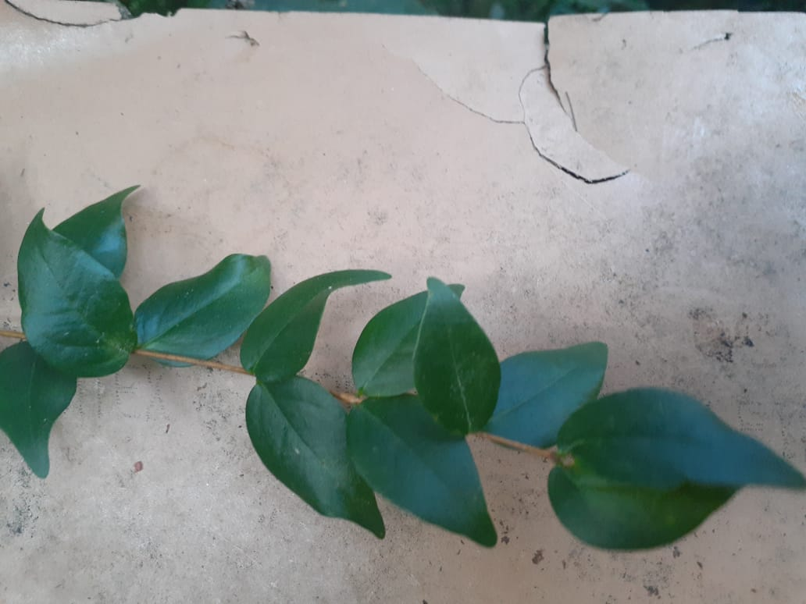

class: top, center

```{r setup, include=FALSE}
options(htmltools.dir.version = FALSE)
```

```{r webcam, echo=FALSE, include= TRUE}
xaringanExtra::use_webcam()
```

```{r xaringan_themes, echo = FALSE, include=FALSE}
	names(xaringan:::list_css())
```

```{r broadcast, echo=FALSE}
xaringanExtra::use_broadcast()
```

## Objetivo

**Orientar o registro fotográfico dos detalhes das plantas visando a identificação das espécies por especialistas.**

.center[

]

---

## Aplicação do conteúdo apresentado

- Alimentar bancos de dados de plantas;

- Compor guias de identificação de espécies;

- Contribuir com a identificação de novas espécies;

- Popularização da ciência e do conhecimento.

exemplo: [inaturalist app](https://play.google.com/store/apps/details?id=org.inaturalist.android&hl=pt_BR&gl=US)

.center[
]
---
## Um pouco de teoria

### O que é classificação botânica sistemática?

### Qual a diferença da identificação feita por “leigos”?
.center[

]

---
### Porque a identificação sistemática é importante?

- **Desvendar os ramos que formam a árvore evolutiva da vida**;
- **Descrever e nomear todas as espécies encontradas**.

.center[

]

_Fonte da imagem :https://pontobiologia.com.br/evolucao-central-biologia/_

---

## Quais as estruturas das plantas importantes para a identificação botânica?

.center[

]
---

## Quais as estruturas das plantas importantes para a identificação botânica?

.center[


]
Fonte: https://www.infoescola.com/plantas/folhas/
---

## Dá pra aumentar a complexidade...mas não será necessário tanto detalhe. UFA!

.center[

]

Fonte:https://www.infoescola.com/plantas/morfologia-interna-da-folha/
---
class: top, center

## Folhas Simples ou compostas?


Fotos da esquerda e centro: Folha de nogueira;
Direita: Ingá
---
class: top, center

## Folhas opostas ou alternas?


### Chamado de Filotaxia das folhas
---
class: top, center

## Flores ou inflorescências?

.center[


]

As *Asteraceae* como o girassol ou a arnica possuem inflorescências.
---
## Outras características que se destacam

.center[


]
Esquerda: Paineira (*Ceiba speciosa*); Direita: Guarapuvu (*Schizolobium parahyba*)
---
## Outras questões relevantes que a fotografia não captura

### Possui latex ao se destacarem as folhas?

### As folhas ou o tronco possuem cheiro?

.center[

]
As *Lauraceae* como a Canela sassafrás (*Ocotea odorifera*) possuem cheiro bem característico.


---
## Para colocar em prática

### a. Tire mais de uma foto. Pelo menos uma da planta inteira;


Pé de goiaba.
---

## Para colocar em prática

### b. Registre o **conjunto de folhas** e não apenas uma (inserção das folhas nos ramos também);


Esquerda: Nogueira; Direita: Cafeeiro.
---

## Para colocar em prática

### c. Se houver, **registre frutos e flores**;


Nozes, pitanga e *Annona cf glabra*
---

## Para colocar em prática

### d. Busque contraste com um **fundo homogêneo** ao registrar estruturas importantes;


--


Pitangueira
---

## Para colocar em prática

### e. As imagens devem ter algo servindo de **escala** (régua, mão, celular, caneta)

.center[


]

---

## Para colocar em prática

### f. **Nitidez é importante.** Logo após o registro, verifique se a foto ficou nítida

.center[

]

---

## Proposta de atividade prática!

.left[
### Vamos nos dividir em dois grupos?

1. O primeiro vai fotografar plantas que **conhecem e sabem o nome**;

2. O segundo vai fotografar plantas que **não conhecem**.
]

.center[

]


---

## Sites para ajudar na identificação das plantas

[CNCFlora](http://www.cncflora.jbrj.gov.br/portal)

[Flora digital do Rio Grande do Sul e de Santa Catarina](http://www.ufrgs.br/fitoecologia/florars/index.php)

[Flora do Brasil 2020](http://floradobrasil.jbrj.gov.br/)

[Flora Fanerogâmica do Estado de São Paulo](https://www.infraestruturameioambiente.sp.gov.br/institutodebotanica/ffesp_online/)

[Guia virtual de plantas da restinga](http://restinga.ib.usp.br/)

[Herbário virtual](http://inct.florabrasil.net/herbario-virtual/)

[JABOT](http://jabot.jbrj.gov.br/v2/consulta.php)

[jSTOR Global Plants database](https://plants.jstor.org/)

[SpeciesLink](http://www.splink.org.br/)

[Tropicos](http://tropicos.org/)
 
---

## Obrigado pela participação!

.center[

]
